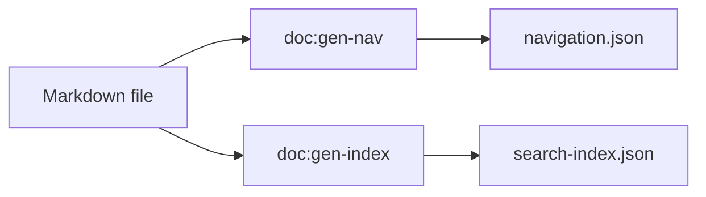
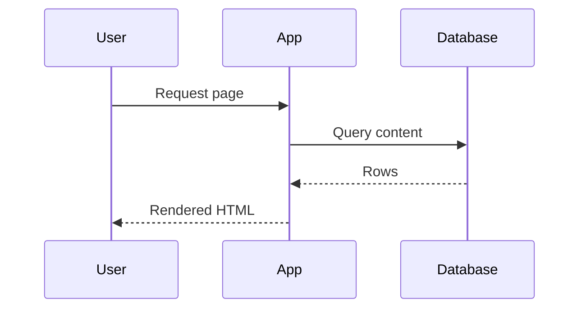

# Markdown Guide

OI Laravel Documentation supports standard CommonMark markdown with GitHub-flavored extensions. This guide covers all supported features.

## Headings

Use hash symbols to create headings (h1-h6):

```markdown
# Heading 1
## Heading 2
### Heading 3
#### Heading 4
##### Heading 5
###### Heading 6
```

**Note:** Use heading 2 (`##`) and below in your content. Heading 1 is reserved for the page title.

## Text Formatting

### Bold

Wrap text in double asterisks or double underscores:

```markdown
**bold text** or __bold text__
```

Result: **bold text**

### Italic

Wrap text in single asterisks or underscores:

```markdown
*italic text* or _italic text_
```

Result: *italic text*

### Bold and Italic

Combine both:

```markdown
***bold and italic*** or ___bold and italic___
```

Result: ***bold and italic***

### Strikethrough

Wrap text in double tildes (GitHub flavored):

```markdown
~~strikethrough text~~
```

Result: ~~strikethrough text~~

## Code

### Inline Code

Wrap code in backticks:

```markdown
Use the `config()` helper to access configuration.
```

Result: Use the `config()` helper to access configuration.

### Code Blocks

Wrap code in triple backticks with language specification:

````markdown
```php
$config = config('oi-documentation');
echo $config['docs_path'];
```
````

Result:
```php
$config = config('oi-documentation');
echo $config['docs_path'];
```

### Supported Languages

Common languages with syntax highlighting:

```php
// PHP
function hello() {
    echo 'Hello, World!';
}
```

```typescript
// TypeScript
function hello(): string {
    return 'Hello, World!';
}
```

```javascript
// JavaScript
function hello() {
    return 'Hello, World!';
}
```

```bash
# Bash
echo "Hello, World!"
```

```json
{
  "name": "example",
  "version": "1.0.0"
}
```

```yaml
# YAML
name: example
version: 1.0.0
```

```python
# Python
def hello():
    print("Hello, World!")
```

```sql
-- SQL
SELECT * FROM users WHERE id = 1;
```

And many more—Shiki supports 100+ languages.

### Code Block Options

#### No Language Specified

````markdown
```
Plain text code block
No syntax highlighting applied
```
````

#### Line Numbers

Use the `{start}` syntax (if your renderer supports it):

````markdown
```php {2}
$config = config('oi-documentation');
echo $config['docs_path'];  // Highlighted
```
````

## Diagrams (Mermaid)

Diagrams are authored **exclusively** with [Mermaid](https://mermaid.js.org) in a fenced code block tagged `mermaid`. Do not use ASCII art, screenshots, or images for diagrams — only `mermaid` blocks are turned into live, theme-aware SVG diagrams.

````markdown

````

Result:


The diagram is rendered to SVG and automatically follows the site's light/dark theme. Any other code block language falls through to syntax highlighting and renders as text, not a diagram.

### Supported Diagram Types

Mermaid supports many diagram types, including:

- `flowchart` / `graph` — flow and process diagrams
- `sequenceDiagram` — interactions over time
- `classDiagram` — class relationships
- `stateDiagram-v2` — state machines
- `erDiagram` — entity-relationship diagrams
- `gantt` — project timelines
- `journey` — user journeys
- `pie` — pie charts

### Sequence Diagram Example

````markdown

````

Result:


### Authoring Tips

- Keep node labels short; wrap text containing spaces or special characters in quotes: `A["Long label"]`.
- Escape reserved characters (`;`, `#`) inside labels instead of leaving them bare.
- Diagrams render with `securityLevel: 'strict'` — raw HTML in labels is stripped, so use Mermaid's own styling directives.
- If a diagram fails to parse, it renders an inline error showing the source; keep each block self-contained and valid.
- Prefer several small diagrams over one dense graph — they read better, especially on mobile.

## Links

### External Links

Create links to external websites:

```markdown
[Visit Laravel](https://laravel.com)
```

Result: [Visit Laravel](https://laravel.com)

### Internal Links

Link to other documentation pages using relative paths:

```markdown
[Installation Guide](./installation.md)
[Configuration](../configuration/_index.md)
[API Reference](/documentation/api/endpoints)
```

These are automatically transformed to proper routes:
- `./installation.md` → `/documentation/getting-started/installation`
- `../configuration/_index.md` → `/documentation/configuration`
- `/documentation/api/endpoints` → kept as-is (absolute path)

### Anchors

Link to specific headings within the same document:

```markdown
[Jump to Installation](#installation)

## Installation

Setup instructions here...
```

## Images

Include images using markdown syntax:

```markdown


```

**Image paths:**
- Relative paths: `./images/logo.png` (relative to current file)
- Absolute paths: `https://example.com/logo.png`
- Public folder: `/img/logo.png` (from public directory)

## Lists

### Unordered Lists

Use asterisks, plus, or hyphens:

```markdown
- Item 1
- Item 2
  - Nested item 2.1
  - Nested item 2.2
- Item 3

* Also works with asterisks
+ And plus signs
```

Result:
- Item 1
- Item 2
  - Nested item 2.1
  - Nested item 2.2
- Item 3

### Ordered Lists

Use numbers with periods:

```markdown
1. First item
2. Second item
   1. Nested item 2.1
   2. Nested item 2.2
3. Third item
```

Result:
1. First item
2. Second item
   1. Nested item 2.1
   2. Nested item 2.2
3. Third item

## Blockquotes

Prefix lines with `>`:

```markdown
> This is a blockquote.
> It can span multiple lines.

> Multiple paragraphs
>
> Are separated by blank lines within the blockquote.
```

Result:
> This is a blockquote.
> It can span multiple lines.

> Multiple paragraphs
>
> Are separated by blank lines within the blockquote.

### Nested Blockquotes

```markdown
> Level 1
>> Level 2
>>> Level 3
```

## Tables

Create tables using pipes and hyphens (GitHub flavored):

```markdown
| Header 1 | Header 2 | Header 3 |
|----------|----------|----------|
| Cell 1   | Cell 2   | Cell 3   |
| Cell 4   | Cell 5   | Cell 6   |
```

Result:
| Header 1 | Header 2 | Header 3 |
|----------|----------|----------|
| Cell 1   | Cell 2   | Cell 3   |
| Cell 4   | Cell 5   | Cell 6   |

### Table Alignment

Use colons to align columns:

```markdown
| Left    | Center  | Right  |
|:--------|:-------:|-------:|
| Left    | Center  | Right  |
```

Result:
| Left    | Center  | Right  |
|:--------|:-------:|-------:|
| Left    | Center  | Right  |

### Complex Tables

Tables can contain inline formatting:

```markdown
| Command | Description | Example |
|---------|-------------|---------|
| `config()` | Get config value | `config('app.name')` |
| `env()` | Get env variable | `env('APP_KEY')` |
```

## Horizontal Rules

Create a horizontal line with three or more hyphens, asterisks, or underscores:

```markdown
---

***

___
```

## Line Breaks

Add two spaces or backslash at end of line to create a line break:

```markdown
First line  
Second line

First line\
Second line
```

## Escape Characters

Escape special markdown characters with backslash:

```markdown
\*Not italic\*
\[Not a link\](https://example.com)
\# Not a heading
```

Result: \*Not italic\* \[Not a link\] \# Not a heading

## HTML

Limited HTML is supported inline:

```markdown
This is <strong>bold</strong> text.

This is <em>italic</em> text.
```

**Note:** Avoid complex HTML. Use markdown formatting instead.

## Comments

HTML comments are preserved but hidden from rendering:

```markdown
<!-- This is a comment and won't be displayed -->

Regular text here.
```

## Special Markdown Features

### Task Lists

Create checkboxes (GitHub flavored):

```markdown
- [x] Completed task
- [ ] Incomplete task
- [ ] Another task
```

Result:
- [x] Completed task
- [ ] Incomplete task
- [ ] Another task

### Definition Lists

Not standard markdown, but supported in some renderers:

```markdown
Term 1
:   Definition 1

Term 2
:   Definition 2a
:   Definition 2b
```

### Footnotes

Some renderers support footnotes:

```markdown
This is a note[^1].

[^1]: This is the footnote content.
```

## Best Practices

1. **Use proper heading hierarchy** - Don't skip levels (h1 → h3 is bad)
2. **One h1 per page** - Your page title is the h1
3. **Use descriptive link text** - `[read more](link)` is bad, `[installation guide](link)` is good
4. **Format code properly** - Always specify language in code blocks
5. **Draw diagrams with Mermaid** - Use `mermaid` blocks for every diagram; never ASCII art or images
6. **Use tables sparingly** - They're hard to read on mobile
7. **Keep line length reasonable** - 80-100 characters is typical
8. **Use blank lines** - Separate blocks with blank lines for readability
9. **Escape special characters** - Use backslash when needed

## Examples

### Complete Page Example

```markdown
---
title: Getting Started with Laravel
description: Learn the basics of Laravel
order: 1
---

# Getting Started with Laravel

Laravel is a modern PHP framework that makes web development enjoyable.

## Installation

Install Laravel using Composer:

```bash
composer create-project laravel/laravel my-app
cd my-app
php artisan serve
```

## Your First Route

Create a route in `routes/web.php`:

```php
Route::get('/', function () {
    return 'Hello, World!';
});
```

## Next Steps

Learn more about [controllers](./controllers.md) and [routing](../configuration/routing.md).

---

> **Tip:** Check the [Laravel documentation](https://laravel.com/docs) for comprehensive guides.
```

## Troubleshooting

### Code Block Not Highlighted

Ensure you specify a language:

```markdown
✓ ```php
  echo 'code';
  ```

✗ ```
  echo 'code';
  ```
```

### Images Not Loading

Check the path:

```markdown
✓   # Relative path

✗   # Absolute path
```

### Links Not Working

Ensure relative links use the correct syntax:

```markdown
✓ [Link](./other-page.md)
✓ [Link](../other-section/_index.md)
✗ [Link](other-page.md)  # Missing ./
```

### Table Rendering Issues

Ensure proper alignment of pipes and hyphens:

```markdown
✓ | Header 1 | Header 2 |
  |----------|----------|
  | Cell 1   | Cell 2   |

✗ | Header 1 | Header 2 |
  |---|---|
  | Cell 1 | Cell 2 |
```
